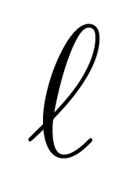
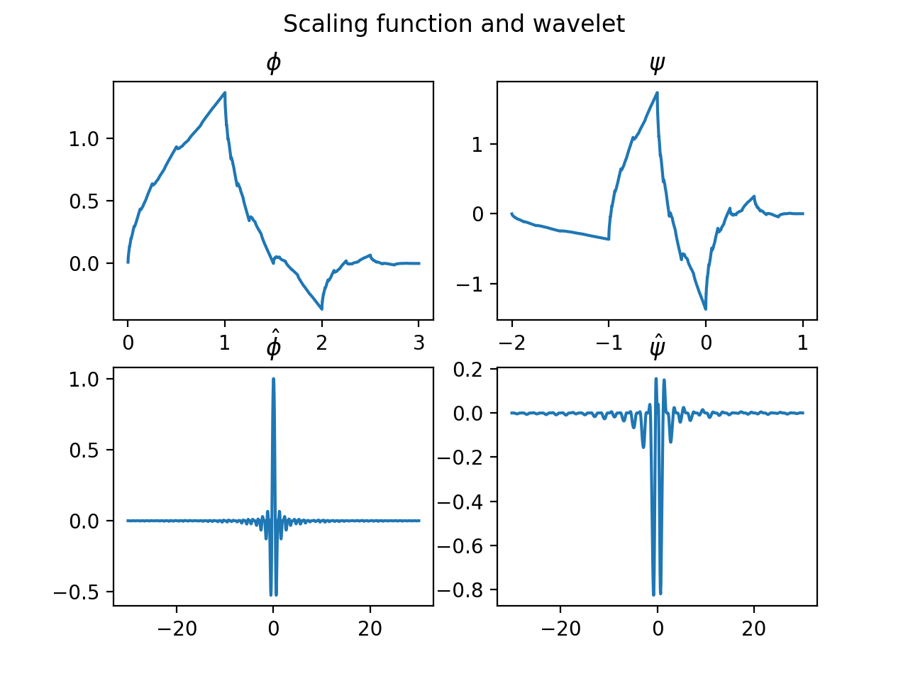

# Ell

The space of sequences, and the operators on it.

$\ell$ is latex code of l, offen used as the space of sequences.

And Ell takes the symbol as its logo:

 

## Concepts

A sequence is an array (`numpy.ndarray`) with start-index and end-index. I wll call it an *ell* in the context.

When adding or other operator acting on two sequences, you have two fit their indexes, that has been done by a decorator silently.


the space of sequences is a type of normal (Banach) space, also a type of *-normal (Banach) algebra


## Motivations

To implement the algorithms in wavelet analysis.

## Requirements

mainly and heavily requires `numpy`

for image classes, it also needs  [pillow](https://pillow.readthedocs.io/en/stable/)


## Download

Plz download it from *github*. It is not loaded up to *pypi* currently.

## Main classes

### Basic classes

`BaseEll`: Base calss of all space of sequences

`Ell1d, Ell2d`: sequences on $\Z$ and $\Z^2$

`Ellnd`: higher-dim sequances

`BaseMultiEll`: multi-values version of `BaseEll`, similarly it has following two subclasses

`MultiEll1d, MultiEll2d`: sequances with multi-values, such an image which is an instance of `MultiEll2d` with 3 values.


#### some mixin class

`AsReal` let the star-operator equal to `refl` operator, but one have to guarantee that no complex number joins the operations.

`ImageLike`: only for image class

### Applied classes

`Filter < Ell1d`

`ImageRGB, ImageGray < MultiEll2d`


### Examples

Before test the examples, plz import classes with`from ell import *`

#### basic operation

Ell is a subclass of numpy.ndarray, so it inherits all methods of ndarray. Functions defined on arrayes can act on ells and return Ell objects in most case.

```python
a = Ell1d([1,2,3,4])
b = Ell1d([2,3,4,5,5,6], min_index=-3)
c = Ell1d([-2.0, -3.0, -4.0, -4.0, -3.0, -3.0, 4.0], min_index=-3)
assert a-b==c

# tensor prod of Ell1d
assert isinstance(a.tensor(), Ell2d)
```


Only difference is that in Ell, we use `@` to implement convolution, as in following example.

```python
from ell import *

gm = 1/ 159 * Ell2d([[2, 4, 5, 4, 2],
[4, 9, 12, 9, 4],
[5, 12, 15, 12, 5],
[4, 9, 12, 9, 4],
[2, 4, 5, 4, 2]])  # gaussian mask

im = ImageRGB.open('src/lenna.jpg')

(im-im @ gm).to_image().show()

```

convolution with Ell1d

```python
"""Sobel edge detection
"""

from ell import *

s1 = Ell1d([-1,-2,-1])
s2 = Ell1d([1,0,-1])

im = ImageGray.open('lenna.jpg')
s_im = im.conv1d(s1, axis=0).conv1d(s2, axis=1)

# <=> s_im = im @ s1.tensor(s2) but might more slow

(s_im).to_image().show()
```


### draw wavelets

Run following script to draw in scaling function and wavelet wrt the filter.

```python
#!/usr/bin/env python3

"""Draw the graph of Daubeches' scaling function and wavelet.
"""

from ell import *

d_filter = Filter.from_name('db2')

phi, psi, t1, t2 = d_filter.scaling_wavelet(level=12)

def plot(ax, fx, xlim, *args, **kwargs):
    L = len(fx)
    ax.plot(np.linspace(*xlim, L), fx, *args, **kwargs)


import matplotlib.pyplot as plt
fig = plt.figure()
fig.suptitle('Scaling function and wavelet')
ax = fig.subplots(2)
plot(ax[0], phi, t1)
ax[0].set_title(r'$\phi$')
plot(ax[1], psi, t2)
ax[1].set_title(r'$\psi$')
plt.show()
```




#### image process

```python
im ImageRGB.open('lenna.jpg')
im = im @ Ell1d([1/2,-1, 1/2])
# equiv. to im = im @ Ell1d([1/2,-1, 1/2]).tensor()
im.to_image().show()

# filtering by wavelets
im = ImageRGB.open('lenna.jpg')

# reducing with db2 wavelet
im_low = (im @ Filter.from_name('db2').H).D
# implement of Hx = D(x*h~)
# <==> im = im.reduce(Filter.from_name('db2'))
im_low.to_image().show()

im_high = (im @ Filter.from_name('db2').g.H).D
# implement of Hx = D(x*g~) where g is the corresponding high-pass filter
# <==> im = im.reduce(Filter.from_name('db2'))
im_high.to_image().show()

# expanding
im = im_low.U @ Filter.from_name('db2')
# <==> im = im.expand(Filter.from_name('db2'))
im.to_image().show()

# to execute the two steps <==> call im = im.ezfilter(Filter.from_name('db2'))
```


### Experiments

There are some experiements in `examples/` most of whom are related to wavelets. Our ambition is to replace [pywavlets](http://pywavelets.readthedocs.io/en/latest/)

`pyramid.py` is recommanded to run to have a view with pyramid algorithm (developed by Burt & Adelson 1983) which is one of the goals to developing Ell.

`mallat.py` decompose an image as a quadtree.

`image_compress.py` a numerical experiment of image compression

`poisson.py` poisson editting


## TO-DO

- [ ] define filter banks
- [x] design a logo
- [x] index should be a tuple in feature
- [ ] periodic sequences.
- [ ] audio process

