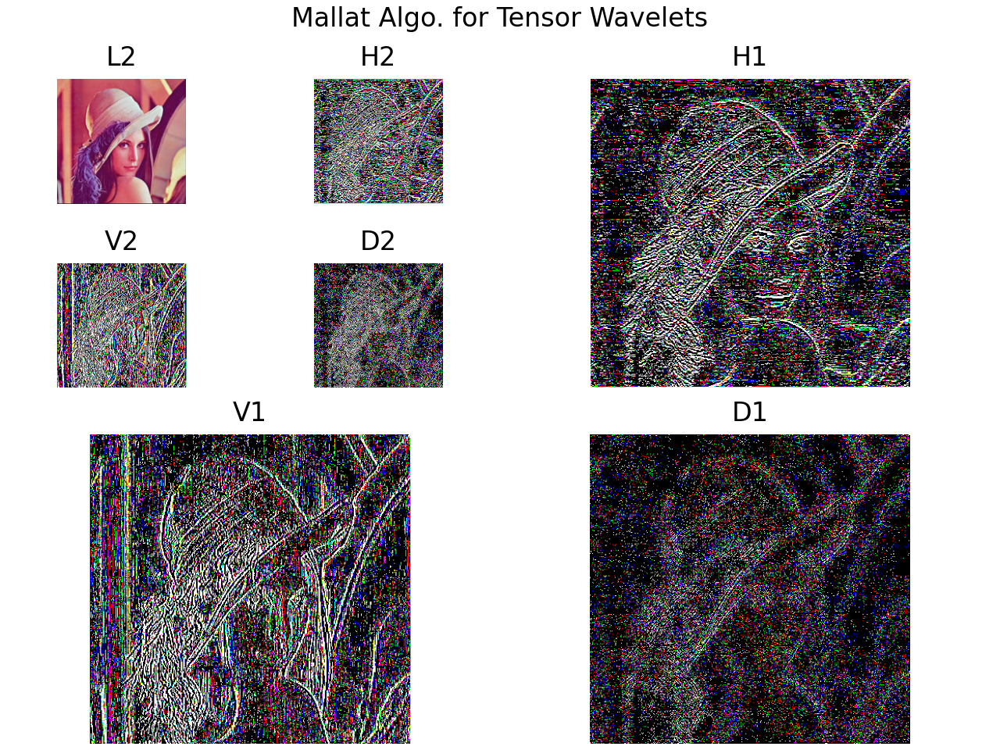

# Ell: 序列空间上运算的实现及其应用

**摘要** 介绍一个Python模块。实现序列空间上的运算。给出几个应用实例。进一步实现小波分析中的算法。

**关键词** 序列空间，Python，Ell，小波分析


## 动机

序列是数学的研究对象。最常见的序列是数列，等价于定义在自然数（或整数）上的函数。数列和幂级数是对应的
$$
\{a_n\} \leftrightarrow \sum a_nz^n
$$
当数列有限时，对应于多项式（或Laurent多项式）。

计算机显然只能存储有有限数列。因此最终可以用Python第三方库numpy提供的array来表示。但是，这么做也有麻烦，数组没有提供指标的上下界。两个数列运算时，即使有相同的维数，但是它们的指标没有对齐，也是不能直接调用array的方法。开发Ell就是为了解决这个难题。

之所以称为Ell，是因为序列构成的整体常用Latex代码\ell表示。在Python程序设计的语境中，我们也把Ell的各种子类称为Ell类，类的对象称为ell。

## 实现思路

实现思路其实也很简单，就是继承numpy.ndarray, 并设置min_index, max_index属性记录数组指标的上下界，如序列$\{1_0,2_1,3_2,4_3\}$指标的上下界分别为0和3。

直接继承numpy.ndarray的基类是BaseEll，其余Ell类是其子类。读者在构造自己的Ell类时，可继承该类。笔者未来扩展新的Ell类也会如此。通常只建议操作min_index, max_index可根据ell的shape推断出来。

在运算的时候，要进行指标的对齐。因此重载所有array基本的代数运算，在调用父方法之前，对齐指标，即给出包含所有上下界的最小范围，参与运算的序列也要通过填充0拉伸到到相应范围。这些处理并不简单，但也是非常关键的。以加法运算为例。

```python
def fit(f):
    # decorator for operators of Ell objects
    def _f(obj, other):
        if isinstance(other, BaseEll):
            mi, ma = common_index(obj.index_pair, other.index_pair)
            obj = obj.resize(mi, ma)
            other = other.resize(mi, ma)
        return f(obj, other)
    return _f
  
class BaseEll
    @fit
    def __iadd__(self, other):
        return _iadd(self, other)
      
def common_index(*index_pairs):
    # common index, the minimal range containing all ranges
    mi, ma = tuple(zip(*index_pairs))
    return np.min(mi, axis=0), np.max(ma, axis=0)
```

指标对齐，最关键的两步：计算公共指标，然后根据公共指标进行resize。resize的细节比较复杂，不宜展示。对于一维ell，主要操作用伪代码描述。

```python
m = min_index - self.min_index
M = max_index - self.max_index

if m < 0:
    # 在self前面/左侧补0
elif m > 0:
    # 对self切片
if M > 0:
    # 在self后面/右侧补0
elif M < 0:
    # 对self切片
# 获得新ell并返回(具有公共指标)
```


代码已经上传至GitHub。

## 应用实例

下面讲讲Ell基本用法。Ell的API尽可能和array一致，因此非常容易上手。我们来看几个简单实例。

运行前，请导入`import ell import *`

### 简单实例：

Ell是numpy.ndarray的子类，继承了几乎所有数组运算。由于Ell的设计，运算时，不要求两个ell对齐，但应该有相同的维度。下面做一个序列减法。

$\{1_0,2_1,3_2,4_3\}-\{2_{-3},\cdots, 7_2\}$

```python
a = Ell1d([1,2,3,4]) # min_index=0
b = Ell1d([2,3,4,5,6,7], min_index=-3)
c = Ell1d([-2.0, -3.0, -4.0, -4.0, -4.0, -4.0, 4.0], min_index=-3)
assert a-b==c
# tensor prod of Ell1d
assert isinstance(a.tensor(), Ell2d)
```

只有一个运算例外，重载 `@`用来实现卷积。 @在numpy中是运来计算矩阵乘积的，而序列的卷积等价于其对应的Topelitz型矩阵的乘积。下面我们用非常简单的命令实现Sobel边缘检测。

```python
# 构造 Sobel 矩阵
s1 = Ell1d([-1,-2,-1])
s2 = Ell1d([1,0,-1])
s = s1.tensor(s2)

im = ImageGray.open('lenna.jpg')
sim = im @ s
# Ell 允许一维和高维ell沿矩阵轴进行卷积，速度会更快
# sim = im.conv1d(s1, axis=0).conv1d(s2, axis=1)
sim.imshow()
```


### 复杂实例：图像处理

图像是二维序列。为了处理彩色图像，需要增加一维存储三个chennel值。因此底层的array是三维的，但这个序列依然是二维的，而第三维不需要指标。这样的类被称为多值序列。基类为BaseMultiEll，子类有MultiEll1d, MultiEll2d, MultiEllnd, 意义与单值序列相似，其中MultiEll2d是图像序列类ImageRGB的父类.

很幸运，numpy的API使得多值序列类大多数方法可以直接继承BaseEll无需重载。

卷积运算可以完成一些简单的图像处理任务，但是这里要实现小波分析中著名的Mallat算法。

运行GitHub仓库中examples/mallat.py文件，产生如下图像。算法运行非常成功。



## 未来任务

Ell还处于开发中。未来首先会建立表示音频的Ell类。这没有较大的技术难点。比较有难点的是定义稀疏序列。需要一个和数值数组对应的数组记录指标。可能还会考虑混合形式，比如二维序列，第一维稀疏，第二维不稀疏。这又将是一个大工程。稀疏ell，和一般ell共享运算，只是存储形式不同，非常适合于存储具有稀疏性的小波系数。


**参考文献**


[] numpy

[] Pillow

